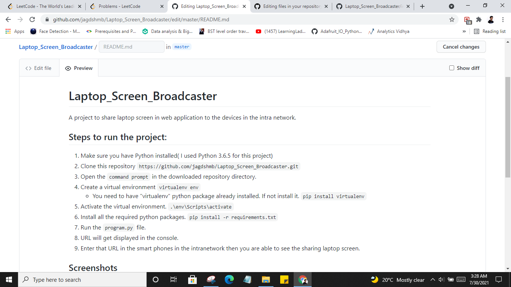
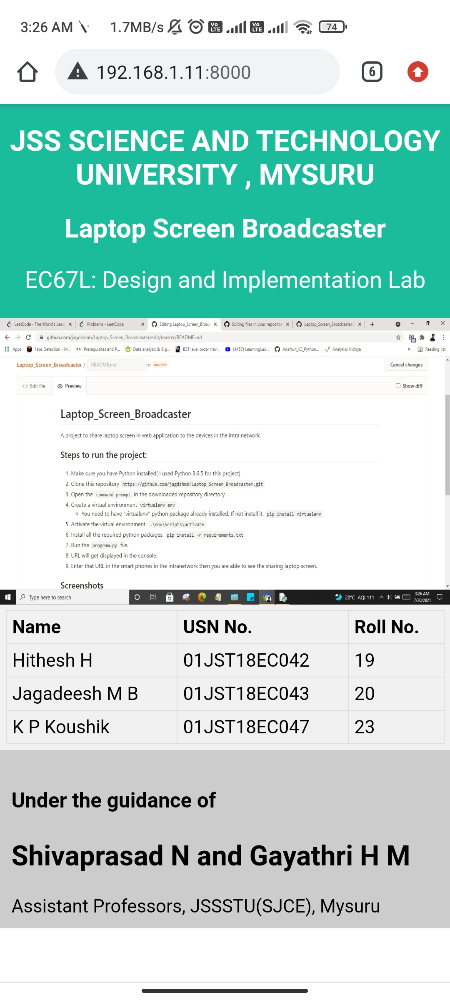

# Laptop_Screen_Broadcaster
A project to share laptop screen in web application to the devices in the intra network.

## Steps to run the project:
1. Make sure you have Python installed( I used Python 3.6.5 for this project)
2. Clone this repository `https://github.com/jagdshmb/Laptop_Screen_Broadcaster.git`
3. Open the `command prompt` in the downloaded repository directory.
4. Create a virtual environment `virtualenv env`
     - You need to have "virtualenv" python package already installed. If not install it. `pip install virtualenv`
5. Activate the virtual environment. `.\env\Scripts\activate`
6. Install all the required python packages. `pip install -r requirements.txt`
7. Run the `program.py` file.
8. URL will get displayed in the console.
9. Enter that URL in the smart phones in the intranetwork then you are able to see the sharing laptop screen.

## Screenshots

## Technologies used

1. Python(3.6.5)
2. Flask (Webframework)
3. HTML (UI)
4. CSS (UI)

